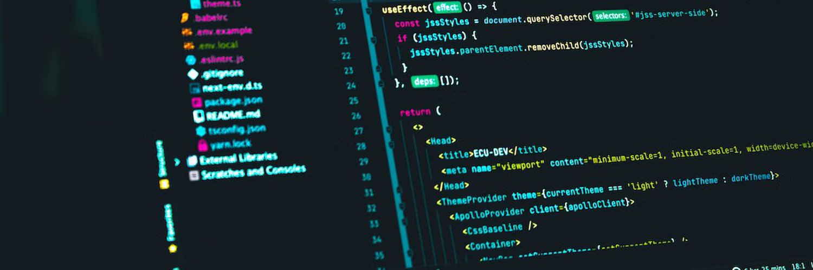
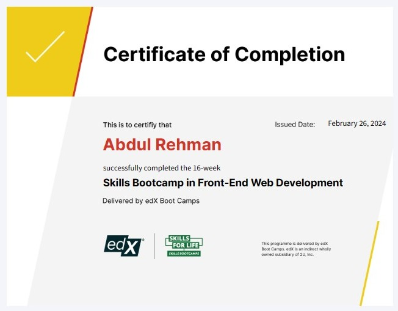
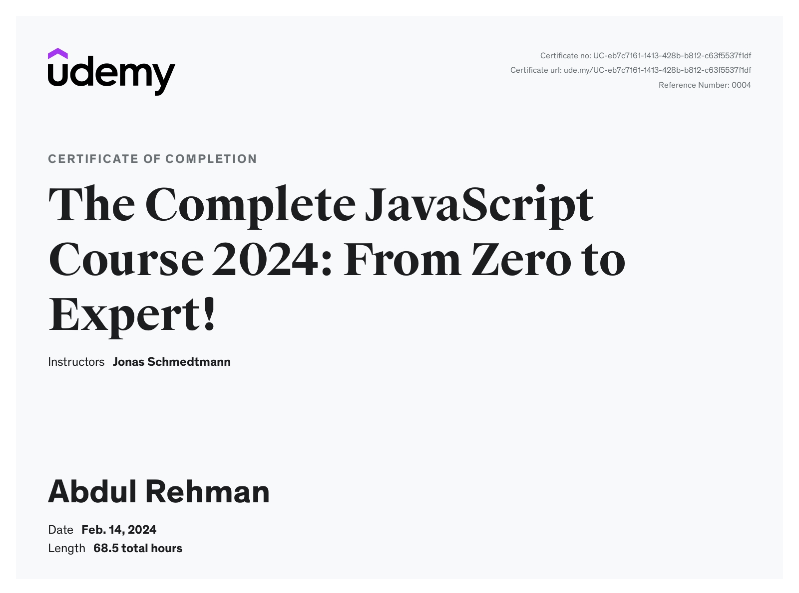

### Hi there 👋, my name is Abdul Rehman
#### Create stunning websites

I'm Abdul Rehman. I am currently enrolled in the edX boot camp for Front-End developers. I am currently learning React. I am passionate about coding and enjoy learning new features and concepts to apply into my code.

Skills: REACT / JavaScript / HTML / CSS

- 🌱 I’m currently learning React and Node js
- Skills Bootcamp in Front-End Web Development: 91%

            

  

## Certificates

